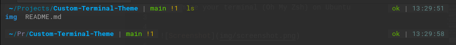

# Custom-Terminal-Theme
Customize your terminal (Oh My Zsh) on Ubuntu




## Update the packages
  ```
    sudo apt-get update
    sudo apt upgrade
  ```

## Install prerequisite packages (ZSH, powerline & powerline fonts)
   ``` 
    sudo apt install zsh
    sudo apt-get install powerline fonts-powerline
   ```

## Clone the Oh My Zsh Repo
   ```
    git clone https://github.com/robbyrussell/oh-my-zsh.git ~/.oh-my-zsh
   ```

## Create a New ZSH configuration file
   ``` 
    cp ~/.oh-my-zsh/templates/zshrc.zsh-template ~/.zshrc
   ```

## Install PowerLevel9k!
   ``` 
    git clone https://github.com/bhilburn/powerlevel9k.git ~/.oh-my-zsh/custom/themes/powerlevel9k
   ```

## Set up a theme for your Terminal — Open .zshrc File using gedit editor
   ``` 
    nano ~/.zshrc
   ```

## And change and put these lines :
   ``` 
    ZSH_THEME="powerlevel9k/powerlevel9k"
    POWERLEVEL9K_DISABLE_RPROMPT=true
    POWERLEVEL9K_PROMPT_ON_NEWLINE=true
    POWERLEVEL9K_MULTILINE_LAST_PROMPT_PREFIX="▶"
    POWERLEVEL9K_MULTILINE_FIRST_PROMPT_PREFIX=""
   ```

## Change your Default Shell
   ``` 
    chsh -s /bin/zsh
   ```